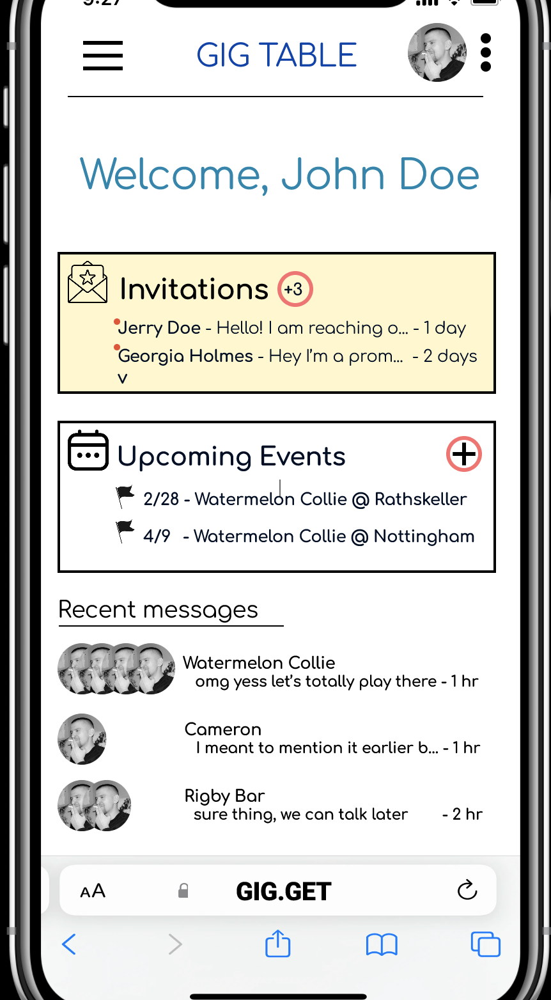
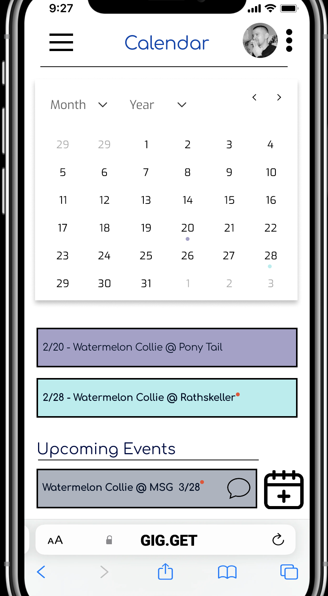
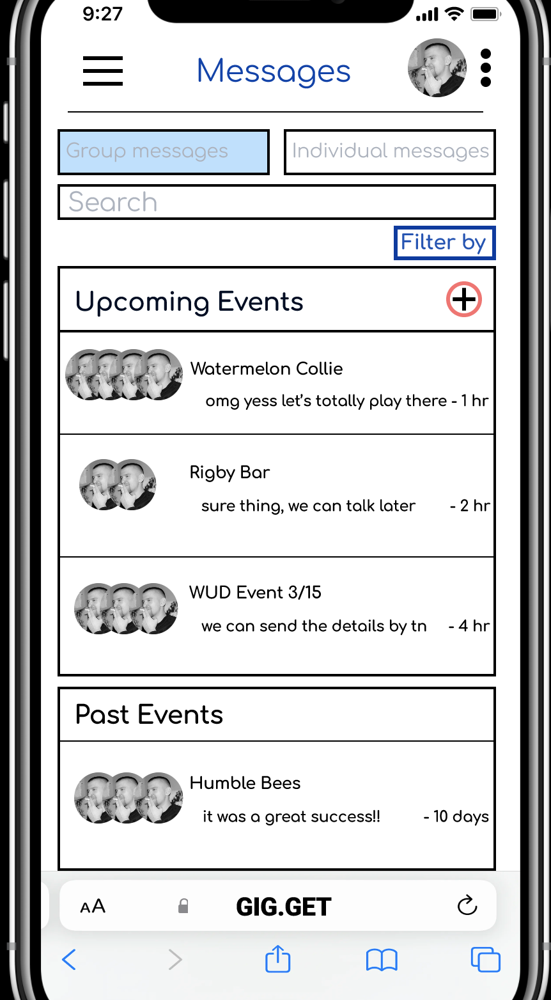
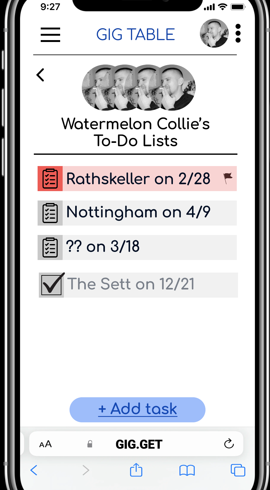

# GigTable - Connect with Local Musicians and Manage Gigs

**[GigTable](https://www.figma.com/proto/y5FJGzhRAOEzIQckA1z1XS/Final-Prototype?node-id=6-1162&starting-point-node-id=6%3A1162&mode=design&t=fD9sKJm1kEy24eha-1)** is your all-in-one platform for simplifying gig organization, communication, and task management for local musicians and bands in the Madison area and beyond. This GitHub repository contains various folders that encompass the ideation, analysis, prototyping, evaluation, and the final prototype of the GigTable project.

## Table of Contents

1. [Idea Generation and Ideation](#ideation)
2. [Model Analysis](#model-analysis)
3. [Prototyping](#prototyping)
4. [Final Prototype](#final-prototype)
5. [Evaluation](#evaluation)

---

## Idea Generation and Ideation

In this phase, the GigTable concept was born. The ideation process involved brainstorming and generating ideas to address the challenges faced by local musicians when it comes to gig organization and communication.

### Folder: [ideation](ideation)

- [Ideation Session Notes](README.md): Detailed notes from our initial brainstorming sessions.
- [Affinity Diagrams](figures): Visual representations of the ideas and insights gathered during ideation.

---

## Model Analysis

To better understand the user needs and the existing pain points in gig organization, we conducted contextual inquiries and created various models to analyze the process.

### Folder: [model-analysis](model-analysis)

- [Contextual Inquiry Findings](README.md): Insights and findings from our contextual inquiries.
- [Affinity Diagrams and Models](figures): Visual representations of the data collected, including flow models, sequence models, artifact models, cultural models, and physical models.

---

## Prototyping

In this phase, we created low-fidelity and high-fidelity prototypes to address the identified pain points and improve user experience.

### Folder: [prototyping](prototyping)

- [Low-Fidelity Prototypes](README.md): Initial prototypes to test and iterate on our ideas.
- [High-Fidelity Prototypes](README.md): Refined and detailed prototypes created using Figma.

---

## Final Prototype

The final prototype integrates the improvements based on user feedback and testing, providing a user-friendly interface for gig organization, messaging, and task management.

### Folder: [final-prototype](final-prototype)

- [Final Prototype Screenshots](final-prototype/figures): Screenshots and descriptions of the key features of the final prototype.
- [Interactive Prototype](README.md): Link to the interactive final prototype.

---

## Evaluation

The usability study phase involved testing specific tasks with participants to gather data on the effectiveness of GigTable and identify areas for further improvement.

### Folder: [evaluation](evaluation)

- [Usability Study Methodology](README.md): Details about the study design, participants, and session outline.
- [Usability Study Findings](README.md): Key findings and insights from the usability study.
- [Prototype Direction](README.md): Adjustments and improvements planned for GigTable based on the usability study feedback.

---

GigTable aims to revolutionize gig organization for local musicians, making it simpler, more efficient, and less stressful. We invite you to explore the various folders and documents in this repository to gain insight into the journey of creating GigTable.

Feel free to interact with our **[final prototype](https://www.figma.com/proto/y5FJGzhRAOEzIQckA1z1XS/Final-Prototype?node-id=6-1162&starting-point-node-id=6%3A1162&mode=design&t=fD9sKJm1kEy24eha-1)** and experience the future of gig management!

---

**Disclaimer:** GigTable is a fictional project created for educational purposes and does not represent an actual product or service.
