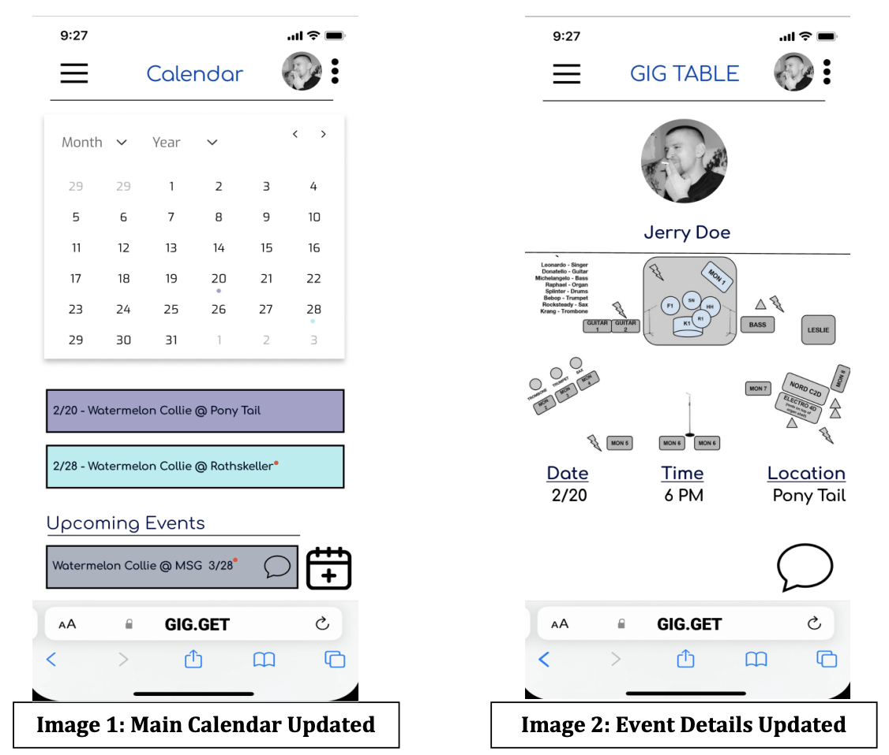
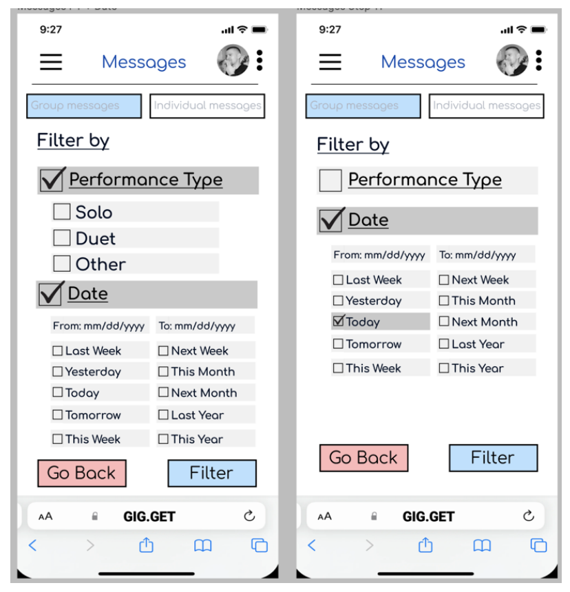
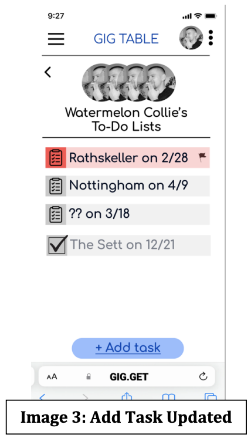
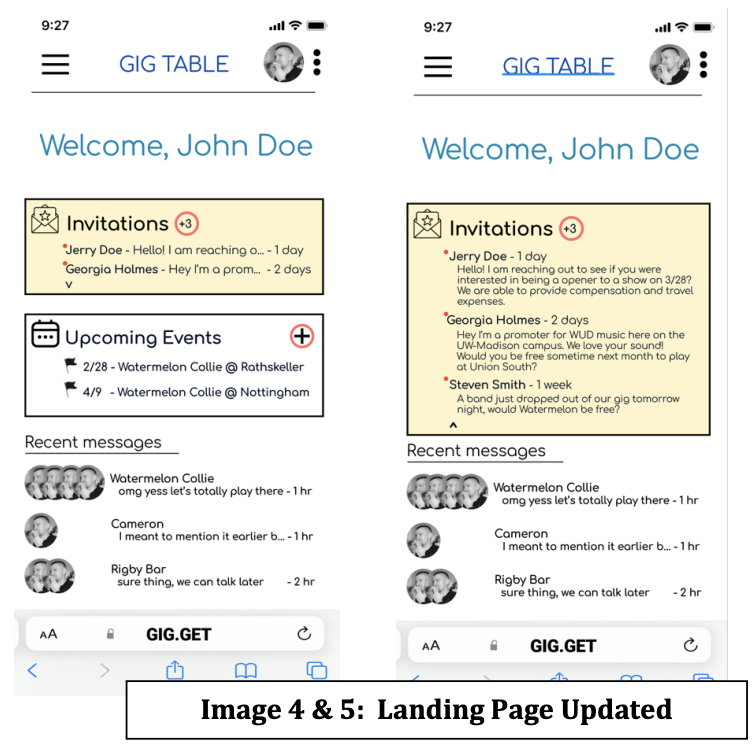

# GigTable.com - Calendar, Messaging, and To-Do Features

## Calendar Feature

After receiving valuable feedback from prototype testing, several new features and visual aids have been integrated into GigTable's calendar:

### Notification System
- A red dot indicator has been added to the calendar to notify users of upcoming events or new notifications.
- This enhancement reduces cognitive load by providing users with immediate event-related information.

### Stage Diagram
- Venue locations now feature a stage diagram, providing bands with insight into equipment placement on the stage.
- This addition was inspired by User 2's input and benefits events that require musicians to provide a stage plot.
- Stage plots can now be shared with all event participants within GigTable.

### Final Prototype
- The final calendar prototype was designed using Figma, including interactive components for different pages and input information saving to create events.

## Messaging Feature

The messaging system's final prototype in Figma incorporates important adjustments based on user testing:

### Landing Page
- The landing page displays recent message previews and provides search and filter options for users.
- Users can efficiently locate specific group chats from a central location.

### Message Filtering
- Users can filter messages based on their preferences, including the type of performance discussed in a specific group chat (e.g., solo, duet, etc.).
- Filters also allow users to sort group chats based on upcoming or past events.

### User Feedback
- Issues identified during user testing, such as difficulties finding the "go back" option while using filters, have been addressed.
- Date filtering has been refined, allowing users to specify date ranges for precise searches.

### Final Prototype Screenshot
- Below is a screenshot of the final messaging prototype with the implemented changes:

## To-Do Feature

A subtle yet impactful adjustment has been made to the To-Do feature:

### "Add Task" Button
- The "checkbox" icon within the "Add Task" button has been removed, simplifying the button's appearance.
- This change reduces potential user confusion and aligns with user feedback, particularly from User 1.

## Landing Page Update

To address confusion regarding event requests and invitations, the landing page has been updated:

### "Invitations" Section
- A new "Invitations" section has been added to the landing page, which can be expanded or collapsed using an arrow indicator.
- Notifications, such as the count of pending invitations and unread notifications (indicated by a red dot), are prominently displayed.
- Clicking on messages takes users directly to event invitations, streamlining the process of accessing and responding to requests.

**[Click here to view and interact with our final prototype.](https://www.figma.com/proto/y5FJGzhRAOEzIQckA1z1XS/Final-Prototype?node-id=6-1162&starting-point-node-id=6%3A1162&mode=design&t=fD9sKJm1kEy24eha-1)**

---

This README.md provides a detailed overview of the calendar, messaging, and To-Do features within GigTable.com, highlighting the enhancements made based on user feedback and testing. These improvements aim to enhance the user experience and streamline communication and event management for musicians and bands.
