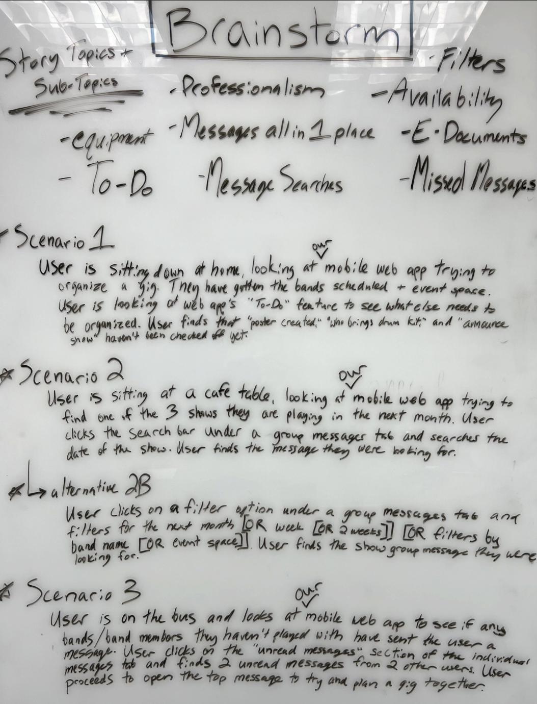
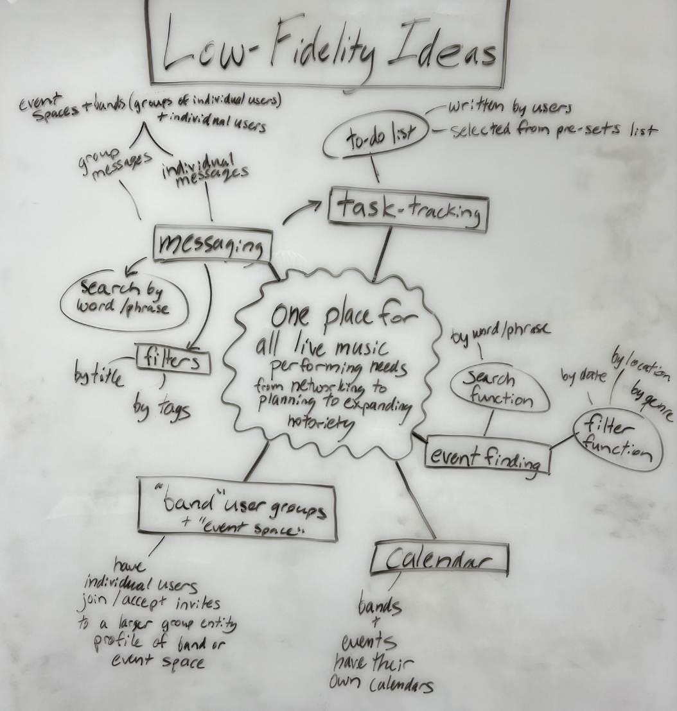
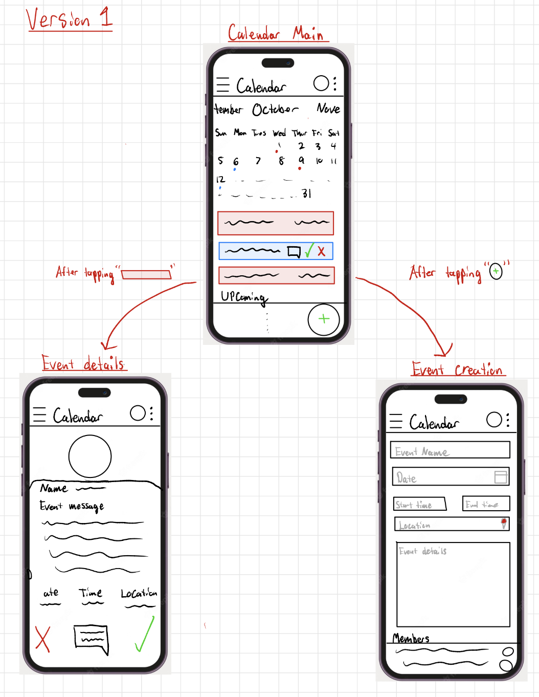
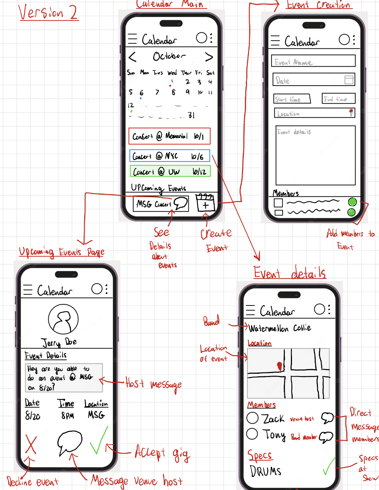
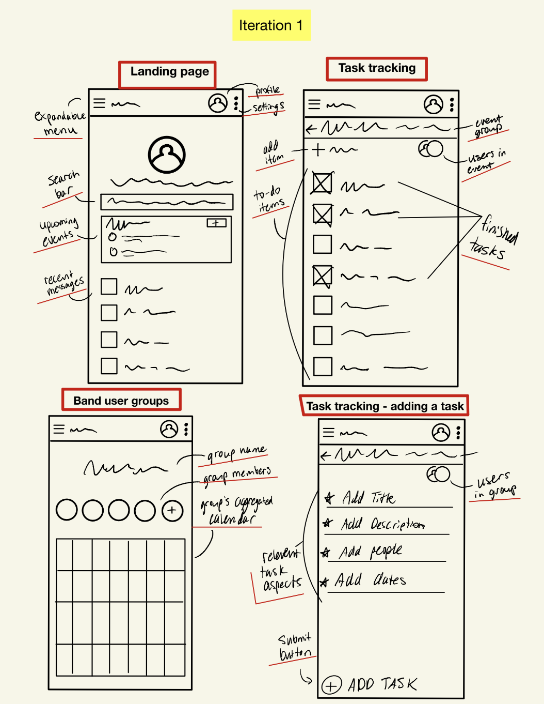
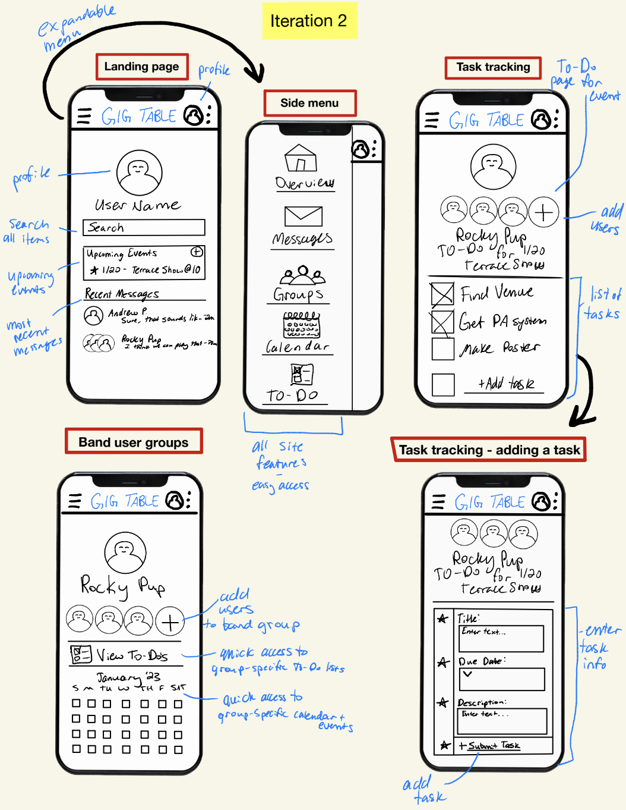
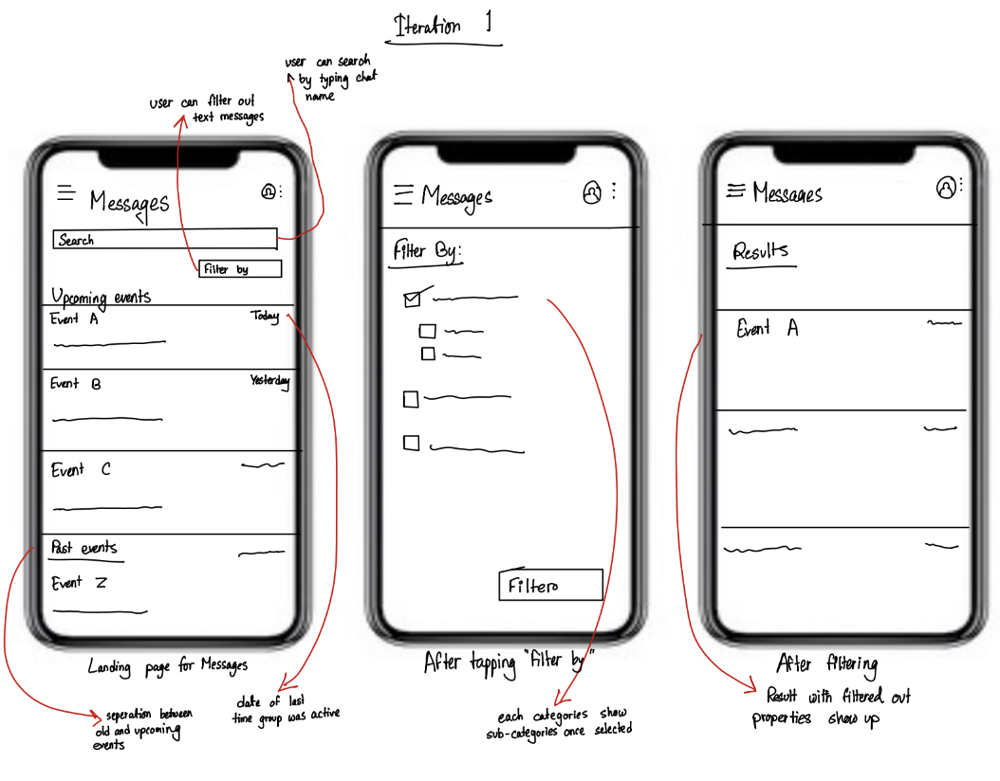
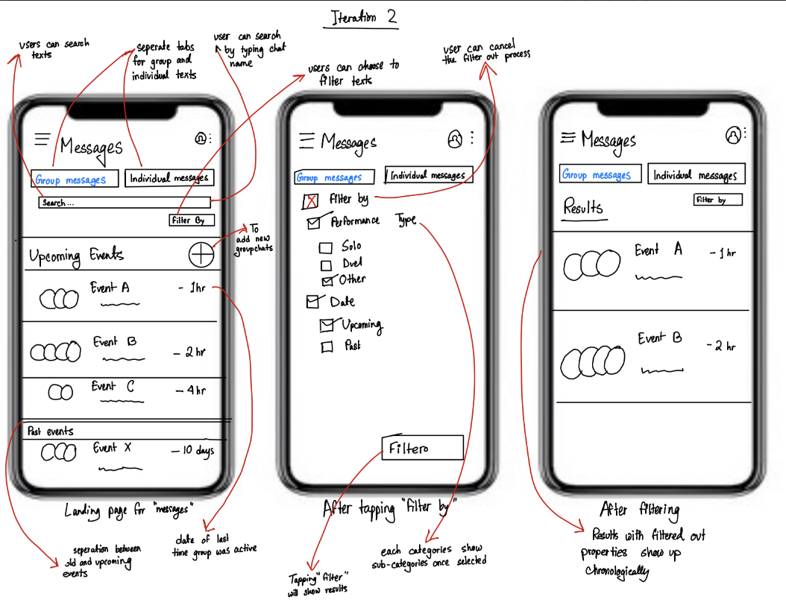

# GigTable.com - Scenarios and Sketches

## Introduction

This README.md document summarizes the findings from the contextual inquiry conducted across three users and the subsequent quality-of-life improvements identified. These improvements were derived from affinity diagrams and translated into user scenarios and feature descriptions.

## Contextual Inquiry Models

The contextual inquiry encompassed five models across three users. These models served as the foundation for understanding user behavior and pain points. Key observations and challenges were as follows:

- **Lack of Organization**: Users faced difficulties in organizing gig-related information.
- **Unsearchable Messages**: Messages were spread across multiple platforms, making them hard to find.
- **Mixing of Messages**: Personal and music-related messages often got mixed up.
- **Tracking Gig Progress**: Users lacked tools to monitor the progress of gig-related tasks.
- **Missing Messages and Events**: Important messages and events were overlooked due to a lack of visibility indicators.
- **Unused Features**: Platform features intended for social media purposes remained unused.
- **No Centralized Calendar**: The absence of a centralized calendar for event organizers and participants posed challenges.
- **Wasted Time**: Users experienced time wastage due to the aforementioned pain points.

## User Scenarios

To address these challenges, three user scenarios were developed, two of which are presented here:

### Scenario 1
**User:** The user is at home, using a mobile web app to organize a gig. They check the app's "ToDo" feature and notice unchecked tasks like "poster created," "who brings drum kit," and "announce show." The user contacts the artist for poster design and reaches out to the venue owner to confirm the drum kit.

### Scenario 2
**User:** The user is at a cafe, accessing a mobile web app to find one of the three shows they are playing in the next month. They use filter options to narrow down group messages by the next month, specific band names, or event spaces.

## Low-Fidelity Prototypes

Three tasks were undertaken to develop low-fidelity prototypes focusing on messaging, calendar, and to-do lists. These prototypes underwent multiple iterations to ensure user-friendliness and accuracy. These served as the foundation for creating a high-fidelity prototype, incorporating user feedback and ideas.

## Conclusion

The contextual inquiry and subsequent improvements paved the way for GigTable.com to enhance its platform. By addressing the identified pain points and incorporating user-friendly features, the platform aims to provide a seamless experience for musicians, event organizers, and venue staff.

---

This README.md provides a third-person perspective on GigTable.com's contextual inquiry, quality-of-life improvements, user scenarios, and feature descriptions.
