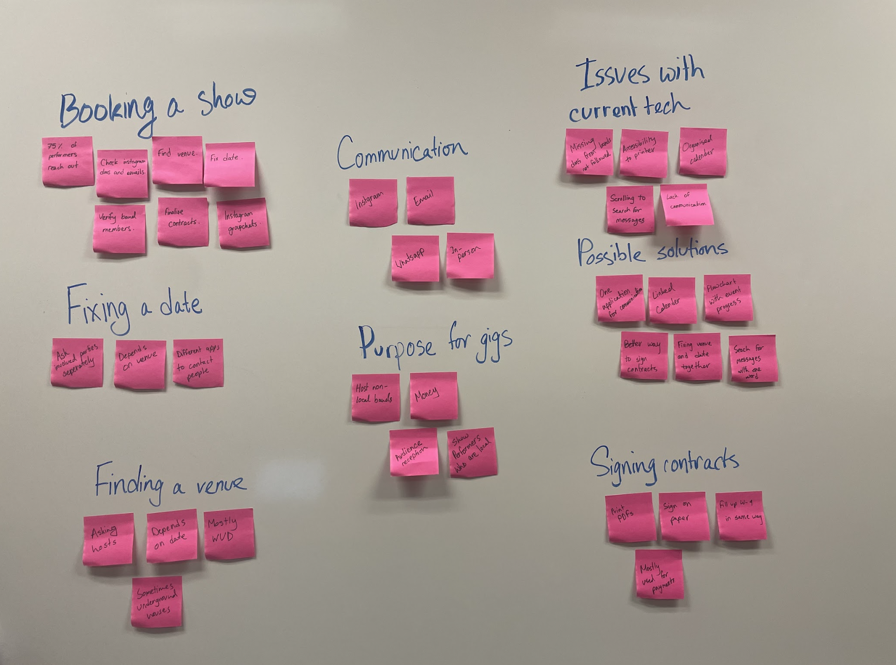

# GigTable.com - Contextual Inquiry and Model Analysis

## Contextual Inquiry

For GigTable.com, a contextual inquiry was performed involving three users to gain insights into their current methods for booking and performing gigs in the Madison and Wisconsin area using available technology and social media platforms. The interviews followed an expert-apprentice method, during which the users explained their processes, tasks, and interactions from gig booking to performance and beyond.

## Model Analysis

The inquiry yielded several stages of analysis and model creation:

### Transcription and Open Coding
- Each interview was transcribed.
- Transcriptions were open-coded to identify key themes and elements.

### User Communication
- Users demonstrated how they communicate with contacts while booking gigs.
- A significant amount of back-and-forth communication was observed.
- Users indicated maintaining personal calendars and chats across various social media platforms.

### Video Transcription
- Video recordings of interviews were transcribed.
- Information from transcriptions was coded.

### Affinity Diagrams (Again)
- Transcribed data was organized into affinity diagrams.
- Affinity diagrams helped form different models.
- Affinity diagrams for each user were designed to understand various aspects, including motivations, problems, tasks, physical aspects, and potential solutions.

### Flow Models
- Flow models were created for artists, musicians, audiences, promoters, and venues.
- These models illustrated communication, expectations, and actions among these stakeholders.
- Issues such as repetitive iterations, clutter, and unused features were identified.

### Sequence Models
- Sequence models visually represented the gig planning process, from wanting to play a gig to promoting a planned gig.
- Obstacles and issues related to the usage of social media platforms were highlighted.

### Artifact Models
- Artifact models reconstructed the physical system users interacted with during gig planning.
- These models showcased the organization and possible problems of user platforms.

### Cultural Models
- Cultural models delved into emotional intents and motivations affecting the gig booking process.
- These models correlated color-coded intents with user interactions.

### Physical Models
- Physical models depicted the layout of gig venues and the transfer of messages during the communication process.
- The physical environment in which users finalized gigs was understood.

## Conclusion

These models were developed to gain a comprehensive understanding of how users currently book gigs using existing technology. They encompass tasks, artifacts, intentions, and breakdowns to inform the development of an interface that resolves their current pain points.

---
