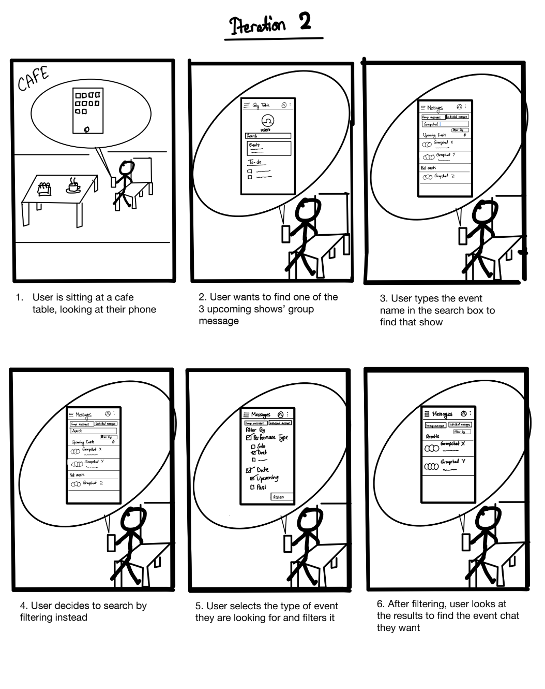

# GigTable.com - Prototyping and Storyboards

## Introduction

This README.md document provides an in-depth overview of the prototyping process for GigTable.com, focusing on the development of storyboards, low-fidelity prototypes, and high-fidelity prototypes. These design choices were informed by insights from the Contextual Inquiry phase, with the primary goal of assisting local bands in obtaining gigs within local venues.

## Storyboards

During the initial stages of prototyping, the team created storyboards based on conclusions drawn from the Contextual Inquiry. These storyboards illustrated behavioral interactions and guided design choices within the prototype, ultimately aimed at resolving user situations and achieving the goal of facilitating gig bookings for local bands.

### Scenario 1: Coordinating Gig Details
The first storyboard describes a user creating a calendar event with the location owner to set up a gig. This scenario addresses the challenge observed during the Contextual Inquiry, where coordinating gig details with band members and venue hosts was challenging. The storyboard proposed a solution by integrating all communication and availability information into a single calendar screen.

## Low-Fidelity Prototype

### Calendar Screen
The low-fidelity prototype was created to address the issue of coordinating availability among band members and venue hosts. It introduced a shared calendar where all stakeholders, including band members and venue hosts, could view each other's availability. Users could create events, add members, specify location, start and end times, and include event messages.

## High-Fidelity Prototype

### Main Calendar (Image 1)
The high-fidelity prototype, developed using Figma, brought the low-fidelity features to life in a functional application. The Main Calendar screen allowed users to view upcoming events and scheduled gigs. Users had the option to create new events or access existing ones.

### Event Description (Image 2)
In the Event Description screen, users could access detailed event information, including descriptions, dates, times, and locations. This feature enhanced transparency and clarity regarding gig details.

### Event Creation (Image 3)
The Event Creation screen allowed users to create events and specify event details to be shared with specific users. This functionality enabled band members to manage their tasks and stay informed about upcoming gigs through a unified calendar. Additionally, it facilitated communication by providing visibility into everyone's availability, reducing the need for repetitive messages.

## Conclusion

The prototyping phase of GigTable.com was informed by insights from the Contextual Inquiry and aimed to address the challenges identified during that phase. By developing storyboards and both low-fidelity and high-fidelity prototypes, the team aimed to create a user-friendly platform that simplifies the process of booking gigs for local bands and venues.

---

This detailed README.md provides a third-person perspective on GigTable.com's prototyping process, including storyboards, low-fidelity prototypes, and high-fidelity prototypes, all designed to enhance the platform's functionality and user experience.

---

# GigTable.com - Enhanced Messaging System

## Introduction

This README.md document provides a comprehensive overview of the development of an enhanced messaging system for GigTable.com. This system was created based on observations and conclusions drawn from Contextual Inquiries, which revealed challenges faced by users in viewing and managing messages within their messaging applications.

## Contextual Inquiry Insights

During the Contextual Inquiries, it was observed that users encountered difficulties in managing their messages, primarily within email or Instagram direct messages. Key challenges included:

- **Message Overload**: Users struggled to filter and organize their messages.
- **Lack of Chains**: Email and Instagram direct messages lacked the ability to create message chains.
- **Lost Messages**: Older messages were frequently lost within the message feeds.

## Messaging System Solution

In response to these challenges, the team developed an enhanced messaging system to provide users with greater control and organization of their messages. This system is illustrated in the storyboard and includes the following features:

### Messaging System Storyboard
- The storyboard depicts how users can filter messages between bands and solo gigs.
- Users can create new group chats for band members or specific events.

## Low-Fidelity Prototype

### Messaging App Main Screen
- Low-fidelity drawings demonstrate the messaging app's main screen.
- Users can filter messages by different group and individual messages, create new group chats, view existing group chats, and access message content within the new group chats.

## High-Fidelity Prototype

### Messages Main Screen (Image 1)
- In the high-fidelity prototype created using Figma, users can access the Messages Main Screen.
- This screen displays important messages related to the best and upcoming events.
  
### Messages Filter (Image 2)
- Users can filter messages based on the date of receipt and the type of performance requested by the venue, such as a solo performance or an entire band.
- This filtering functionality enhances message management and streamlines communication.

## Conclusion

The development of the enhanced messaging system within GigTable.com was a response to the challenges identified during Contextual Inquiries. By providing users with tools to filter, organize, and manage their messages effectively, GigTable.com aims to create a more user-friendly platform that simplifies communication for band members and venue hosts.

---

This detailed README.md provides a third-person perspective on the development of GigTable.com's enhanced messaging system, addressing challenges identified during Contextual Inquiries and presenting solutions through low-fidelity and high-fidelity prototypes.

---
# GigTable.com - Enhanced To-Do Lists

## Introduction

This README.md document provides a detailed account of the development of an enhanced to-do list feature for GigTable.com. The decision to implement this feature stemmed from a recognition of user difficulties in effectively communicating accomplishments within their bands due to message clutter and forgetfulness.

## Importance of To-Do Lists

The team recognized that to-do lists would play a crucial role in facilitating communication and task management within bands and between band members and venue hosts. It was evident that users often struggled to convey their achievements effectively, leading to lost or overlooked accomplishments.

## Storyboard Illustration

To illustrate the significance of this feature, a storyboard was created. It depicted a user simply checking off tasks on their to-do list to inform band members of their achievements without the need to flood the group chat with messages.

## Feedback-Driven Development

The feedback received during the initial stages of development further emphasized the need for shared to-do lists. Users expressed the importance of having a centralized platform where all band members and venue hosts could view tasks related to upcoming gigs. Often, crucial specifications and message responses were not effectively communicated or got lost within messages.

## Low-Fidelity Prototyping

In response to the feedback, a low-fidelity prototype was developed to convey the concept and design of the to-do list feature. Within this low-fidelity prototype, the following key components were designed:

- To-do lists for different groups and bands with meaningful names to enhance organization.
- A task creation screen where users could edit and add tasks for specific users or groups.

## High-Fidelity Implementation

The high-fidelity implementation was realized using Figma, which transformed the concept into a functional feature. Key components of the high-fidelity to-do list feature include:

### Main Screen (Image 1)
- Users can access different to-do lists for each band or gig event.
- Clicking on a specific list leads to the Band To-Do List screen.

### Band To-Do List (Image 2)
- Users can view the tasks that need to be completed for the band or gig event.
- Tasks may include items such as searching for a new gig and specific technical specifications.

### Creating To-Do List (Image 3)
- Users can create different tasks within their respective groups.
- Information such as Title, Due Date, and Description can be added to tasks.

## Conclusion

The implementation of enhanced to-do lists within GigTable.com aims to streamline communication and task management within bands and among users. By providing a centralized platform for task organization and communication, GigTable.com seeks to simplify the planning and execution of gigs for all stakeholders.

---

This comprehensive README.md provides a third-person perspective on the development of GigTable.com's enhanced to-do list feature, highlighting its importance, feedback-driven design, and the key components of both low-fidelity and high-fidelity prototypes.
